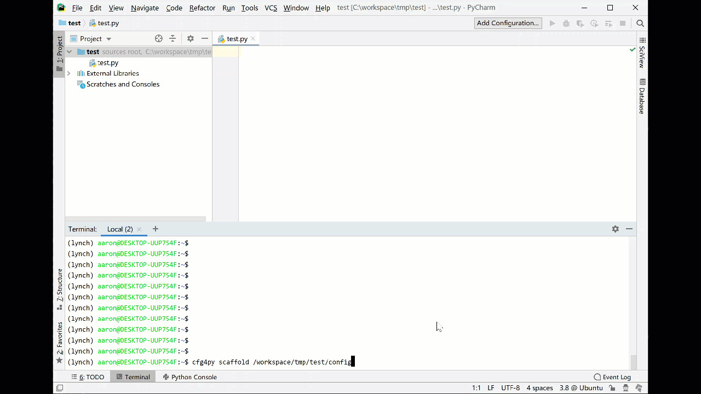

Overview
========

.. image:: https://img.shields.io/pypi/v/cfg4py.svg
        :target: https://pypi.python.org/pypi/cfg4py

.. image:: https://img.shields.io/travis/jieyu_tech/cfg4py.svg
        :target: https://travis-ci.com/jieyu_tech/cfg4py

.. image:: https://readthedocs.org/projects/cfg4py/badge/?version=latest
        :target: https://cfg4py.readthedocs.io/en/latest/?badge=latest
        :alt: Documentation Status

* Free software: BSD license
* Documentation: https://cfg4py.readthedocs.io.

A python config module that:

1. support hierarchical configuration and multiple source (local and remote)
2. IDE auto-complete
3. configuration template (logging, database, cache, message queue,...) generated by console command
4. enable logging in one line

Features
^^^^^^^^

Hierarchical design
--------------------

You have a bunch of severs of the same role, which usually share same configuration. But somehow for troubleshooting or maintenance purpose, you'd like some machines could have its own settings at particular moment.

This is how Cfg4Py solves the problem:

1. Configure your application general settings at remote service, then implement a `RemoteConfigFetcher` (Cfg4Py has already implemented one), which pull configuration from remote serivce periodically.
2. Change the settings resides on local machine, then the change automatically applied.

The hierarchical design can have different meaning. It's common to see that you have different settings for development,
test and production site. They share many common settings, but a few of them has to be different. Cfg4Py has perfect solution supporting for this: adaptive deployment environment support.

Adaptive Deployment Environment Support
---------------------------------------
In any serious projects, your application may run at both development, testing and production site. Except for effort of copying similar settings here and there, sometimes we'll mess up with development environment and production site. Once this happen, it could result in very serious consequence.

To solve this, Cfg4Py developed a mechanism, that you provide different sets for configurations: dev for development machine, test for testing environment and production for production site, and all common settings are put into a file called 'defaults'.

cfg4py module knows which environment it's running on by lookup environment variables __cfg4py_server_role__. It can be one of 'DEV', 'TEST' and 'PRODUCTION'. If nothing found, it means setup is not finished, and Cfg4Py will refuse to work. If the environment is set, then Cfg4Py will read settings from defaults set, then apply update from either of 'DEV', 'TEST' and 'PRODUCTION' set, according to the environment the application is running on.

Quick logging config
--------------------
Many python projects are startup prototype. If it works, then we'll put some really serious effort on it. Before that, we don't want our effort to be waste on common chores. Even though, we do need logging module at most time, to assist us for better troubleshooting.

for that purpose, Cfg4Py provides a one-liner config for enabling logging:

.. code-block::python
    cfg.enable_logging(level, filename=None)

Apply configuration change on-the-fly
-------------------------------------
Cfg4Py provides mechanism to automatically apply configuration changes without restart your application. For local files configuration change, it may take effect immediately. For remote config change, it take effect up to `refresh_interval` settings.

Code assist (auto-complete)
---------------------------
With other python config module, you have to remember all the configuration keys, and refer to each settings by something like cfg["services"]["redis"]["host"] and etc. It's hard to remember all configuration keys, and the way we access these settings is less concise than just use cfg.services.redis.host.

Cfg4Py let you access your settings by the latter format all the time. And, if you trigger a build against your configurations, it'll generate a python class file. After you import this file (named 'cfg4py_auto_gen.py') into your project, then you can enjoy auto-complete!

Credits
-------

This package was created with Cookiecutter_ and the `audreyr/cookiecutter-pypackage`_ project template.

.. _Cookiecutter: https://github.com/audreyr/cookiecutter
.. _`audreyr/cookiecutter-pypackage`: https://github.com/audreyr/cookiecutter-pypackage
