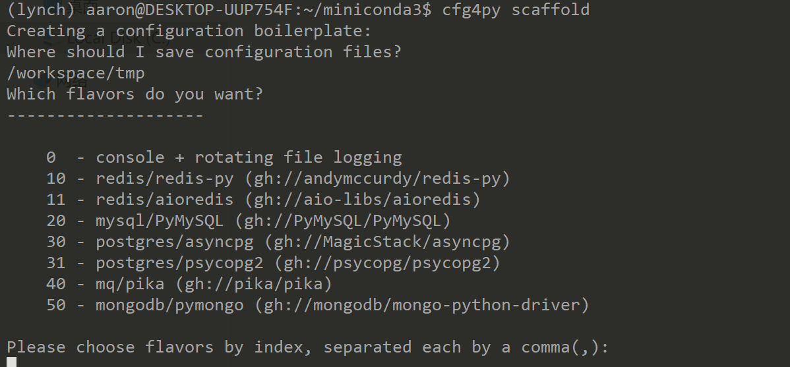

=====
Usage
=====

Quick Guide
-----------

To use Cfg4Py in a project:

.. code:: python

    import cfg4py

    # create config object
    cfg = cfg4py.init(path_to_config_dir)

    # then refer to settings by cfg's properties
    # given the following yaml settings (filename: defaults.yaml) under path_to_config_dir

    # services:
    #   redis:
    #       host: localhost

    # you can access settings by '.'
    print(cfg.services.redis.host)

    # you CANNOT access settings like this way (this will raise exceptions):
    print(cfg["services"])

Exhausted Guide
---------------

Step 1.
~~~~~~~
Use Cfg4Py tool to generate configuration templates:

.. code:: console

    cfg4py scaffold

The output is:

You may need modify settings according to your enviroment.

Step 2.
~~~~~~~
Build config class, and import it into your project:

.. code-block:: console

        cfg4py build /path/to/your/config/dir

.. code-block:: python

        from typing import TYPE_CHECKING
        if TYPE_CHECKING:
            # make sure that schema is at your $PYTHONPATH
            from schema import Config
        import cfg4py

        cfg: Config = cfg4py.init('/path/to/your/config/dir')

        # now you should be able to get auto-complete hint while typing
        cfg.?

Step 3.
~~~~~~~
cfg4py will take care of setting's change automatically, all you need to do is put correct settings into one of
(defaults, dev, test, production) config file. And once you change the settings, it should take effect immediately.

To enable cascading config, you can configure a remote source by implemented a subclass of `RemoteConfigFetcher`. A redis fetcher is provided out-of-box:

.. code-block:: python

        from cfg4py import RedisConfigFetcher
        from redis import StrictRedis

        cfg = cfg4py.int()  # since we're using remote config now, so we can omit path param here
        fetcher = RedisConfigFetcher(key="my_app_config")
        logger.info("configuring a remote fetcher")
        cfg4py.config_remote_fetcher(fetcher, 1)

The settings in redis under `key` should be a json string, which can be converted into a dict object.

Step 4.
~~~~~~~~
Before starting run your application, you should set __cfg4py_server_role__ to any of [DEV,TEST,PRODUCTION] (since 0.9.0, required only if you specified as `strict` mode). You can run the following command to get the help:

.. code-block:: bash

        cfg4py hint set_server_role

.. hint::

        since 0.9.0, you can skip this step, if you don't need adaptive deployment support.

Use cfg4py as a cheat sheet
----------------------------
cfg4py does more than a config module, it can be a cheat sheet for many configurations. For example, want to change pip source (usually you'll if you're in china mainland):

.. code-block:: console

        cfg4py hint pip

        >
        - tsinghua: pip config set global.index-url https://pypi.tuna.tsinghua.edu.cn/simple
        - aliyun: pip config set global.index-url https://mirrors.aliyun.com/pypi/simple/
        - tencent: pip config set global.index-url http://mirrors.cloud.tencent.com/pypi/simple
        - douban: pip config set global.index-url http://pypi.douban.com/simple/

for more, explore by yourself by typing `cfg4py hint`
